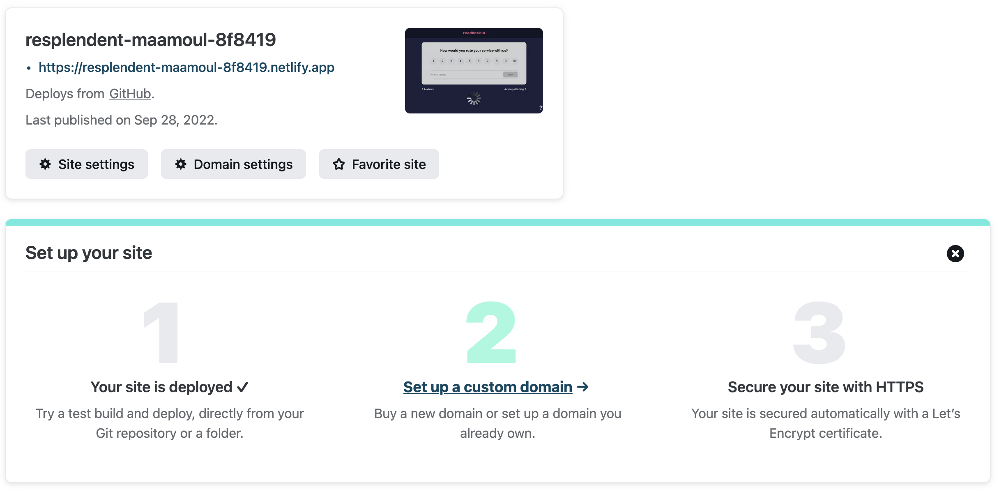
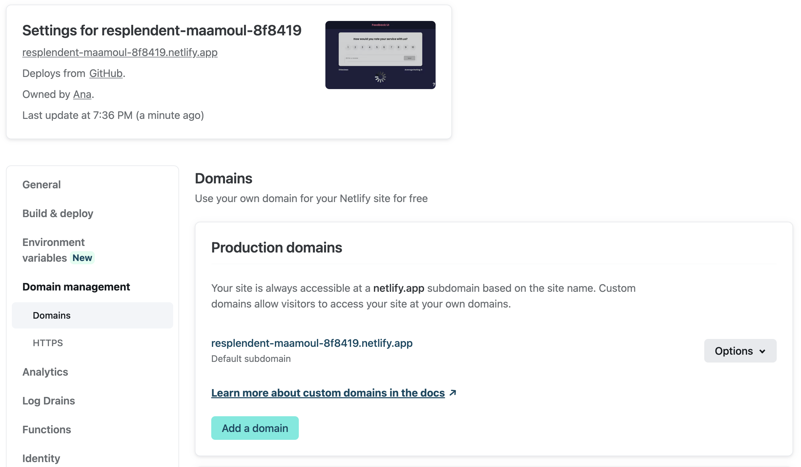
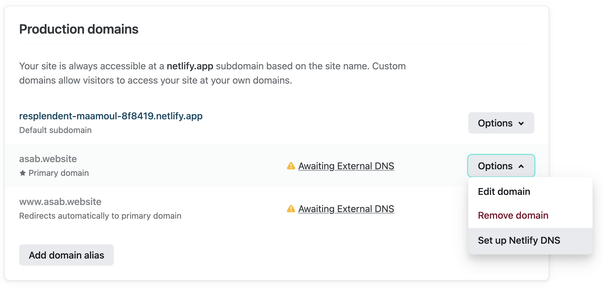
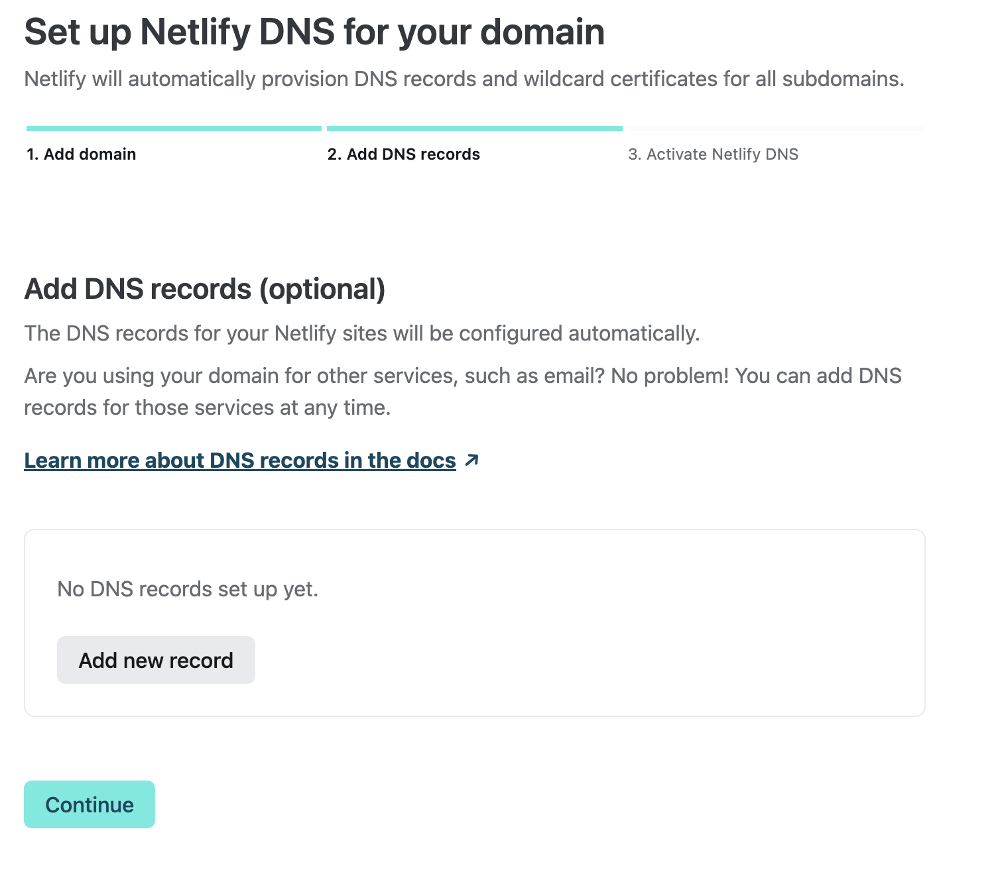
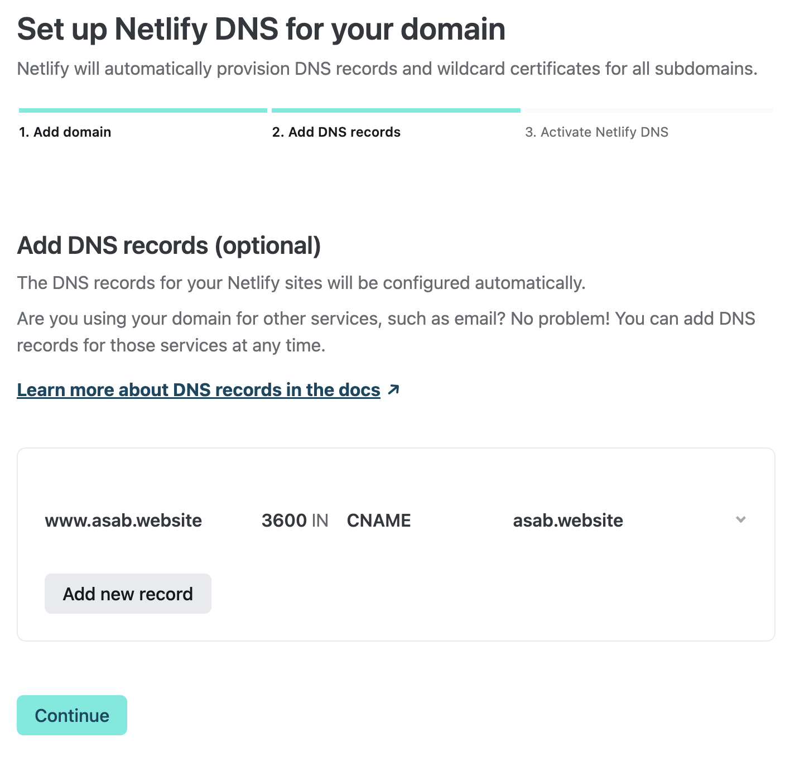
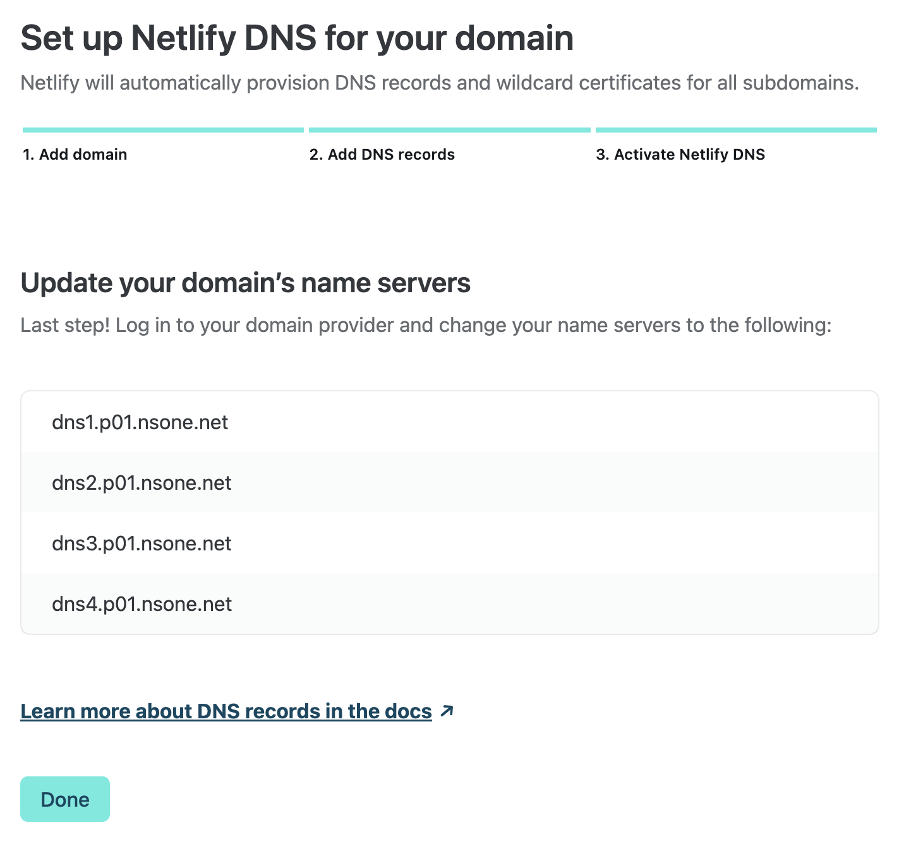

# Guía para asignación de un dominio a la página web del proyecto

### Contenidos
  1. [Prerrequisitos](#prerrequisitos)
  1. [Compra del dominio](#compra-del-dominio)
  1. [Despliegue de la página web en Netlify](#despliegue-de-la-página-web-en-netlify)
  1. [Asignación del dominio en Netlify](#asignación-del-dominio-en-netlify)
  1. [Asignación de DNS en el proveedor del dominio](#asignación-de-dns-en-el-proveedor-del-dominio)
  1. [Recordatorio importante](#recordatorio-importante)

## Prerrequisitos
* Aproximadamente 1 USD para la compra del dominio
* Cuenta en [Netlify](https://www.netlify.com/)
* Cuenta en [GoDaddy](https://www.godaddy.com/es) o la empresa de registro de dominios de tu preferencia
* Front End de una página web alojado en un repositorio de GitHub

## Compra del dominio

Para comprar un dominio web, ingresa a [GoDaddy](https://www.godaddy.com/es). En el buscador escribe el nombre que deseas para tu dominio, allí aparecerán muchas opciones de compra. Ten en cuenta que los dominios finalizados en _.com_ _.net_ y similares son más costosos

Como puedes ver en la imagen, los dominios con las extensiones menos comunes, como lo son .store y .shop, usualmente valen al rededor de un dólar

Para realizar la compra puedes usar una tarjeta de crédito recargable, como lo son las de Nequi o Daviplata.

## Despliegue de la página web en Netlify

## Asignación del dominio en Netlify

1. Ingresa al dashboard de [Netlify](https://www.netlify.com/) 

    

2. Da click en el site que tienes desplegado desde github, luego selecciona la opción **Domain Settings**

    

3. En la parte inferior de la sección de dominios selecciona **Add a domain**

    

4. En la ventana emergente escribe el nombre del dominio que compraste

    

5. Te aparecerá el dominio agregado con una advertencia amarilla, ya que el control sobre los DNS aún está a cargo de Godaddy. Para asignar los DNS de Netlify, da click en el boón desplegable **Options**, y posteriormente en **Set up Netlify DNS**

    

6. Aparecerá una ventana emergente con un paso a paso, donde inicialmente debes dar click para verificar que el dominio agregado es tuyo

    

7. El siguiente paso es opcional, y te permite agregar diferentes formas de acceso a tu página web. Para modificar los DNS records da click en **Add new record**

    

8. Puedes agregar un DNS record de tipo **CNAME**, el cual se refiere a una URL, allí agregarás un prefijo a tu dominio, el cual podrás incluir justo antes de este en la barra de direcciones. Esto permite mostrar diferentes páginas dependiendo del prefijo que se agregue al ingresar en el navegador. En este caso agregamos:
- Record type: CNAME
- Name: www
- Value: el nombre de tu dominio

    

9. En la imagen puedes observar la configuración agregada a tu dominio.

    

10. Finalmente, debes tener presente la lista de name servers para terminar la configuración del dominio en Godaddy:

**Estos name servers se agregan en el paso 6 de la próxima sección**

## Asignación de DNS en el proveedor del dominio

1. Ingresa a la página del proveedor del dominio que compraste. Si seguiste la recomendación de la guía, ingresa a [GoDaddy](https://www.godaddy.com/es).
Selecciona la empresa que creaste al comprar tu dominio

    

2. En el menú de la izquierda, selecciona la opción **Dominio**

    

3. Da click en la opción **Configuración de Dominio**
   
    

4. Selecciona **Administrar DNS** en la parte inferior derecha

    

5. En la pantalla te aparecerán los DNS que tienes asignados actualmente a tu dominio. Da click en **Cambiar**

    

6. En la parte inferior selecciona **Introducir mis propios servidores de nombres (avanzado)**

    

7. Ingresa los DNS correspondientes a Netlify que obtuviste en el paso 10 de la sección anterior

    

8. Acepta la advertencia de actualización de DNS que aparece en pantalla y da click en continuar

    

9. Este es el fin de la configuración. En unas horas podrás acceder a tu dominio en el navegador y verás la página web que tienes almacenada en github

    

## Recordatorio importante

El pago de los dominios se hace de forma automática cada año, siendo el primer año generalmente el único económico. Por lo cual, es recomendable que ingreses a la página de configuración de dominio (del paso 4) y desactives la renovación automática. Esto garantizará que tu acceso al dominio expire un año después de la compra, sin la generación de cobros adicionales a tu tarjeta.
    

***Elaborado por Ana Sofia Aponte Barriga***