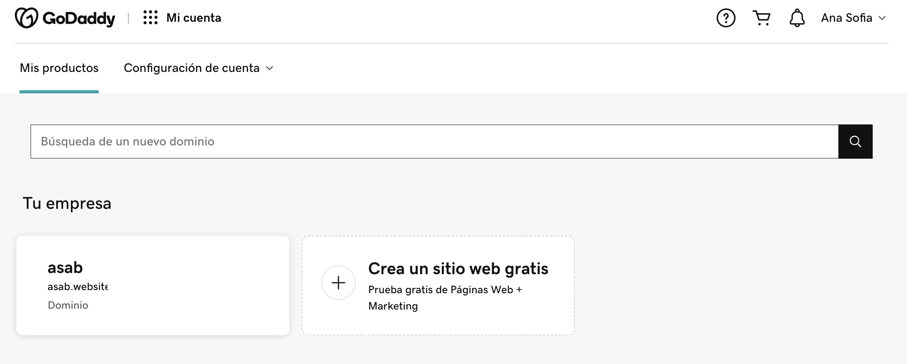
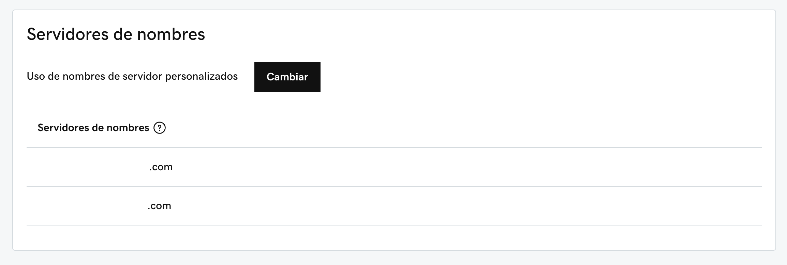
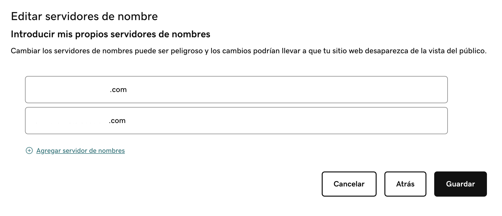
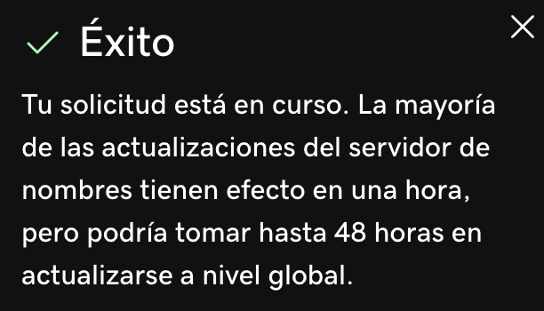
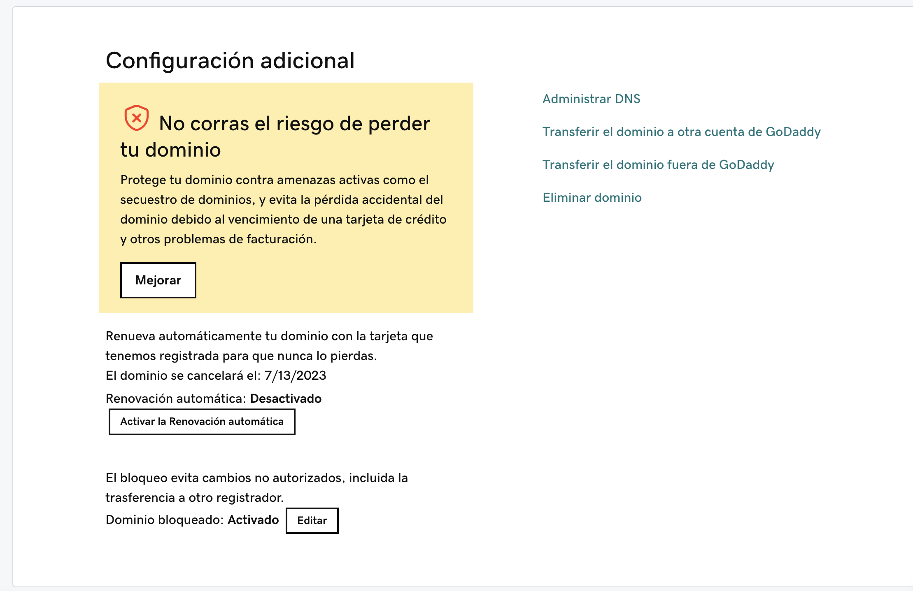

# Guía para asignación de un dominio a la página web del proyecto

### Contenidos
- [Guía para asignación de un dominio a la página web del proyecto](#guía-para-asignación-de-un-dominio-a-la-página-web-del-proyecto)
    - [Contenidos](#contenidos)
  - [Prerrequisitos](#prerrequisitos)
  - [Compra del dominio](#compra-del-dominio)
  - [Despliegue de la página web en Netlify](#despliegue-de-la-página-web-en-netlify)
  - [Asignación del dominio en Netlify](#asignación-del-dominio-en-netlify)
  - [Asignación de DNS en el proveedor del dominio](#asignación-de-dns-en-el-proveedor-del-dominio)
  - [Recordatorio importante](#recordatorio-importante)

## Prerrequisitos
* Aproximadamente 1 USD para la compra del dominio
* Cuenta en [Netlify](https://www.netlify.com/)
* Cuenta en [GoDaddy](https://www.godaddy.com/es) o la empresa de registro de dominios de tu preferencia
* Front End de una página web alojado en un repositorio de GitHub

## Compra del dominio

## Despliegue de la página web en Netlify

## Asignación del dominio en Netlify

## Asignación de DNS en el proveedor del dominio

1. Ingresa a la página del proveedor del dominio que compraste. Si seguiste la recomendación de la guía, ingresa a [GoDaddy](https://www.godaddy.com/es).
Selecciona la empresa que creaste al comprar tu dominio

    

2. En el menú de la izquierda, selecciona la opción **Dominio**

    

3. Da click en la opción **Configuración de Dominio**
   
    

4. Selecciona **Administrar DNS** en la parte inferior derecha

    

5. En la pantalla te aparecerán los DNS que tienes asignados actualmente a tu dominio. Da click en **Cambiar**

    

6. En la parte inferior selecciona **Introducir mis propios servidores de nombres (avanzado)**

    

**FALTA LA PARTE DE ENCONTRAR EL DNS EN NETLIFY!!!!!!!!!!!!**

7. Ingresa los DNS correspondientes a Netlify que puedes encontrar en......

    

8. Acepta la advertencia de actualización de DNS que aparece en pantalla y da click en continuar

    

9. Este es el fin de la configuración. En unas horas podrás acceder a tu dominio en el navegador y verás la página web que tienes almacenada en github

    

## Recordatorio importante

El pago de los dominios se hace de forma automática cada año, siendo el primer año generalmente el único económico. Por lo cual, es recomendable que ingreses a la página de configuración de dominio (del paso 4) y desactives la renovación automática. Esto garantizará que tu acceso al dominio expire un año después de la compra, sin la generación de cobros adicionales a tu tarjeta.
    