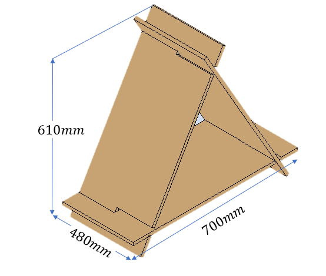

# Selección de Productos

## Universidad Nacional de Colombia
## Automatización de Procesos de Manufactura
## Grupo 2 - Proyecto PurpleWood
Ana Sofía Aponte Barriga

Juan Andrés Bueno Hortúa

Oscar Javier Manrique Merchán

Ivanna Lisette Medina Cruz

Juan Sebastián Rangel Araque

## Productos Seleccionados
A continuación se presenta cada uno de los productos seleccionados, incluyendo una imagen del modelo realizado, las dimensiones del mismo, materiales, acabados, función, y proceso de manufactura.

## Selección de Materiales
En cuanto a la materia prima, esta se seleccionó según dos criterios: primero la facilidad con la que podría ser transformada y segundo la disponibilidad en el mercado. 

Se decide tomar como insumo principal tableros de madera de 122 x 244 cm en distintos calibres. Más adelante se especifica en cada producto el material a usar. 

1. **Organizador de escritorio estilo mesa**

- Modelo:
 
    

- Plano:

    

- Materiales:
    * Triplex Pino Fenolico 122cm x 244cm espesor de 15mm.
    * Barniz.
    * Pegante o adhesivo.

- Acabados:
    Se desea tener un buen acabado al tratarse de un elemento de hogar y oficina, por ello se planean procesos de:
    * Resanado.
    * Lijado.
    * Barnizado.

    Esto con el fin de lograr un buen acabado.

- Función: 
    Agujeros no pasantes de distintos tamaños que sirven como portaobjetos, para organizar utencilios personales o de oficina como: lápices, celular, vasos, clips, entre otros.

- Despiece: 

    | Código | Pieza          | Descripción                                   | Ancho | Alto  | Largo |
    |--------|----------------|-----------------------------------------------|-------|-------|-------|
    | MO1    | Tabla ranurada | Pieza principal con las ranuras organizadoras | 15mm  | 135mm | 500mm |
    | MO2    | Patas          | Pieza que servirán de apoyo                   | 15mm  | 115mm | 60mm  |

    Para los codigos de las piezas se propone la siguiente nomenclatura, donde las dos primeras letras indican el producto al que pertenece como se muestra a continuación:
    * MO: Mesa Organizadora
    * CG: Casa Gato.
    * RL: Repisa Lego

    Y el número del final indica el numero de la pieza.

- Proceso de Manufactura:

    

    A continuación listamos los pasos definidos:
    * Se inicia el proceso con un tablero de 1.22m x 2.44m x 15 mm. En este se fresan primero todas las ranuras y luego se hacen cortes para separar cada una de las piezas. Se plantea un lote de entre 14 a 18 unidades. Se da un espacio para corte de 2mm (material consumido por la sierra, sin embargo esta cantidad puede ser modificada sin problema alguno) 
    * Para las tablas se calcula su longitud antes del biselado, la cual corresponde a 58.8mm x 115mm (la precisión en este caso no importa, por lo que se trabajara con 60mm x 115mm. Siguiendo un esquema de corte similar al anterior (corte en arreglo rectangular) se lograría un lote de 380 piezas, por lo tanto suponiendo un lote de tablas principales de 18 unidades se necesitaría una proporción de 10:1. Esto puede implicar la necesidad de almacenar piezas lo cual no es deseado, por ello se podrían considerar tableros de piezas mixtas con este u otros productos. 
    * Las tablas de las patas deben ahora ser biseladas para obtener la forma de trapecio. 
    * Una vez biseladas todas la tablas pueden pasar a un proceso de resanado, lijado y barnizado. 
    * Una vez barnizadas todas las piezas se puede proceder al ensamble. 
    * Por último se empaqueta. 

2. **Repisa Bloque**

- Modelo:
 
    

- Plano:

    

- Materiales:
    * Triplex Pino Fenolico 122cm x 244cm espesor 9mm y 25mm.
    * Barniz.
    * Pegante.

- Acabados:
    Se desea tener un buen acabado al tratarse de un elemento decorativo para el  hogar, por ello se planean procesos de:
    * Resanado.
    * Lijado.
    * Barnizado.
    Esto con el  fin de lograr un buen acabado.

- Función: Sostener objetos dentro de la cavidad principal.

- Despiece:

    | Código | Pieza              | Cantidad | Descripción                                     | Ancho | Alto | Largo |
    |--------|--------------------|----------|-------------------------------------------------|-------|------|-------|
    | RL1    | Frente con Botones | 1        | Pieza principal con las extrusiones decorativas | 25mm  | 80mm | 480mm |
    | RL2    | Trasera            | 1        | Pieza que dará a la pared y servirá de apoyo    | 12mm  | 80mm | 480mm |
    | RL3    | Fondo              | 1        | Es el fondo de la repisa                        | 12mm  | 62mm | 480mm |
    | RL4    | Lateral            | 2        | Conforman los laterales                         | 12mm  | 71mm | 62mm  |

- Proceso de Manufactura:

    

    A continuación listamos los procesos definidos:
    * Primero se hace el fresado de los cilindros de las piezas RL1 (frente) y luego se secciona. Dado que esta pieza se hace a partir de un tablero de 25 mm no se puede manufacturar en conjunto con otras piezas. Se puede obtener un lote de 70 piezas.
    * Las demas piezas pueden obtenerse en simultaneo de un tablero dado que las demás comparten el mismo calibre de 12 mm.
    * Una vez cortadas todas las piezas se hace el resanado, lijado y barnizado de las piezas.
    * Por ultimo se empaqueta
3. **Casa para gato**

- Modelo:
 
    

- Plano:

    

- Materiales:
    * aTriplex Pino Fenolico espesor de 12 mm.
    * Barniz.
    * Pegante o adhesivo.
    * Tela rascadero.
    * Velcro.
    * Cojin.
    * Tapones de goma.

- Acabados:
    Se desea tener un buen acabado al tratarse de un elemento de hogar, por ello se planean procesos de:
    * Resanado.
    * Lijado.
    * Barnizado.

    Adicionalmente si bien no ha sido modelado se planea la inclusión de una superficie "rascadero" y un cojin en el producto.

- Función: Cama para que una mascota (gato o perro pequeño) duerma.

- Despiece:
    A continuación se presentan una tabla con las piezas cantidades y medidas:
    
    | Código | Pieza                     | Cantidad | Descripción                                    | Ancho | Alto  | Largo |
    |--------|---------------------------|----------|------------------------------------------------|-------|-------|-------|
    | CG1    | Tabla ranura asimétrica   | 1        | Pieza principal que hace de base para la casa  | 12mm  | 700mm | 300mm |
    | CG2    | Tabla ranura simétrica    | 2        | Conforman las paredes del mueble               | 12mm  | 700mm | 300mm |

- Proceso de Manufactura:

    

    A continuación listamos los pasos del proceso de producción:
    * Primero se planea el fresado de todas las ranuras de un lote en un mismo tablero y al cortar se logra obtener un lote de 12 tablas ya ranuradas. Teniendo en cuenta que primero se harían todas las ranuras y que estas se pueden programar, por cada lote se podrían sacar las piezas en la proporción adecuada para el armado del producto final, teniendo una proporción 2:1 en los tipos de tabla. 
    * Una vez cortadas las tablas se procede a su resanado, lijado y barnizado. 
    * Luego se separa el lote segun la distribución de ranuras.
    * Segun el tipo de pieza se pegan los elementos correspondientes: Topes, "rascador", cojin.
    * Por ultimo se empacan las piezas.

4. Otras consideraciones.
- Otros Materiales
En esta sección incluimos otros materiales asociados al proceso productivo pero que no se relacionan al producto, principalmente se considera insumos para empaques o demas elementos que acompañan el producto:

 Por el momento se consideran:
    * Cajas.
    * Plasticos de embalaje.
    * Publicidad de los productos.
    * Manuales.
    

