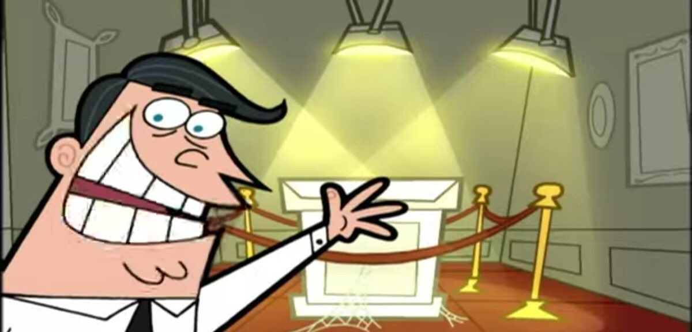

# Selección de Productos

## Universidad Nacional de Colombia
## Automatización de Procesos de Manufactura
## Grupo 2 - Proyecto PurpleWood
### Ana Sofia Aponte Barriga
### Juan Andrés Bueno Hortúa
### Oscar Javier Manrique Merchám
### Ivanna Lisette Medina Cruz
### Juan Sebastián Rangel Araque

## Productos Seleccionados
A continuación se presenta cada uno de los productos seleccionados, incluyendo una imagen del modelo realizado, las dimensiones del mismo, materiales, acabados, función, y proceso de manufactura. Los archivos de modelado se pueden encontrar en la carpeta **XXXXX**

## Selección de Materiales
En cuanto a los materiales decidimos seleccionar materia prima según dos criterios, primero la facilidad con la que podría ser transformada en las materias primas y segundo la disponibilidad en el mercado 

Se escoge tomar como insumos tableros de 122 x 244 cm en distintos calibres, se especifica en cada producto el material a usar. 

1. **Organizador de escritorio estilo mesa**

Modelo:
 

Plano:

Materiales:
* Triplex Pino Fenolico espesor de 15mm

Acabados:
Se desea tener un buen acabado al tratarse de un elemento de hogar y oficina, por ello se planean procesos de:
* Resanado.
* Lijado.
* Barnizado.

Esto con el fin de lograr un buen acabado

Función: Agujeros no pasantes de distintos tamaños que sirven como portaobjetos, para organizar utencilios personales o de oficina como: lápices, celular, vasos, clips, entre otros.

Despiece 

| Codigo | Pieza                     | Cantidad | Descripción                                    | Ancho | Alto  | Largo |
|--------|---------------------------|----------|------------------------------------------------|-------|-------|-------|
| CG1    | Tabla  ranura asimétrica  | 1        | Pieza Principal que hace de base para la casa  | 12mm  | 700mm | 300mm |
| CG2    | Tabla ranura simétrica    | 2        | Conforman las paredes del mueble               | 12mm  | 700mm | 300mm |

Proceso de Manufactura:

2. **Repisa**

Modelo:
 

Plano:

Materiales:
* Triplex Pino Fenolico espesor 9mm y 25mm

Acabados:
Se desea tener un buen acabado al tratarse de un elemento decorativo para el  hogar, por ello se planean procesos de:
* Resanado.
* Lijado.
* Barnizado.
Esto con el  fin de lograr un buen acabado.

Función: Sostener objetos dentro de la cavidad principal.

Despiece:

| Codigo | Pieza              | Cantidad | Descripción                                     | Ancho | Alto | Largo |
|--------|--------------------|----------|-------------------------------------------------|-------|------|-------|
| RL1    | Frente con Botones | 1        | Pieza principal con las extrusiones decorativas | 25mm  | 80mm | 480mm |
| RL2    | Trasera            | 1        | Pieza que dara a la pared y servira de apoyo    | 12mm  | 80mm | 480mm |
| RL3    | Fondo              | 1        | Es el fondo de la repisa                        | 12mm  | 62mm | 480mm |
| RL4    | Lateral            | 2        | Conforman los laterales                         | 12mm  | 71mm | 62mm  |

Proceso de Manufactura:
**Acá van los diagramas de flujo**

3. Casa para gato

Modelo:
 

Plano:

Materiales:
* aTriplex Pino Fenolico espesor de 12 mm

Acabados:
Se desea tener un buen acabado al tratarse de un elemento de hogar, por ello se planean procesos de:
* Resanado.
* Lijado.
* Barnizado.

Adicionalmente si bien no ha sido modelado se planea la inclusión de una superficie "rascadero" y un cojin en el producto.

Función: Cama para que una mascota (gato o perro pequeño) duerma.

Despiece:
A continuación se presentan una tabla con las piezas cantidades y medidas:

| Codigo | Pieza          | Descripción                                   | Ancho | Alto  | Largo |
|--------|----------------|-----------------------------------------------|-------|-------|-------|
| MO1    | Tabla ranurada | Pieza principal con las ranuras organizadoras | 15mm  | 135mm | 500mm |
| MO2    | Patas          | Pieza que serviran de apoyo                   | 15mm  | 115mm | 60mm  |

Proceso de Manufactura:
**Acá van los diagramas de flujo**

## Preguntas que surgieron en el proceso
