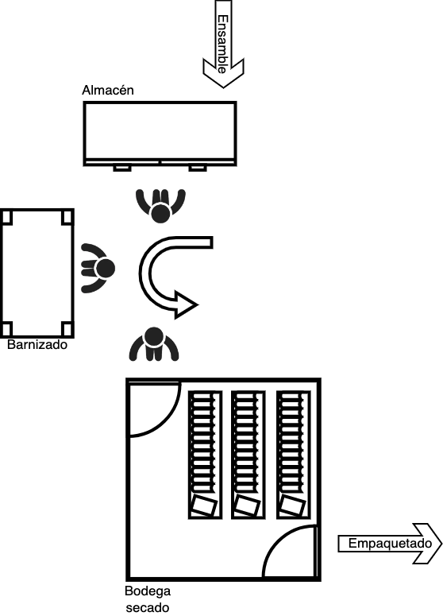
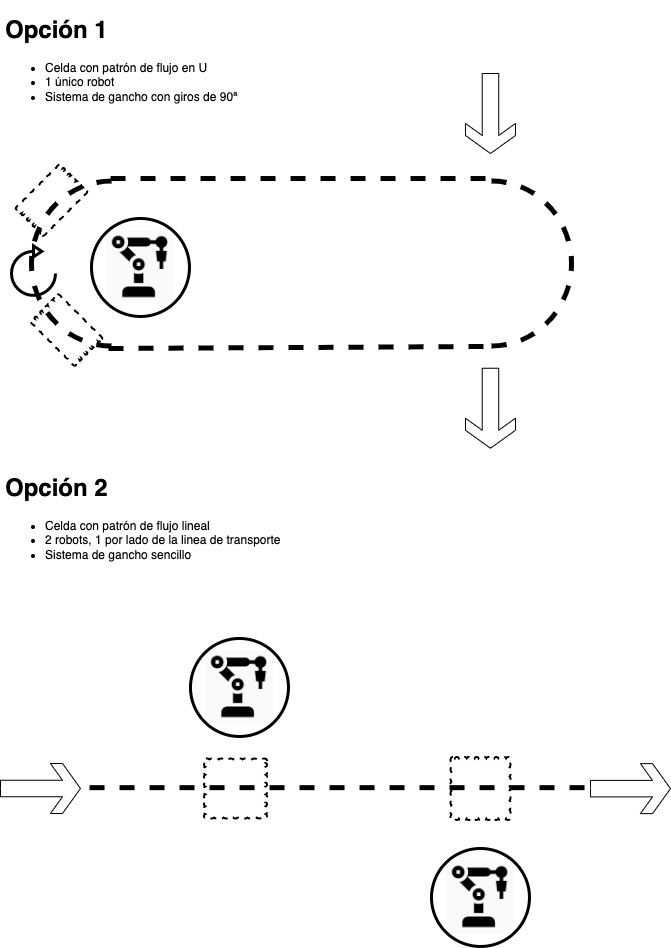
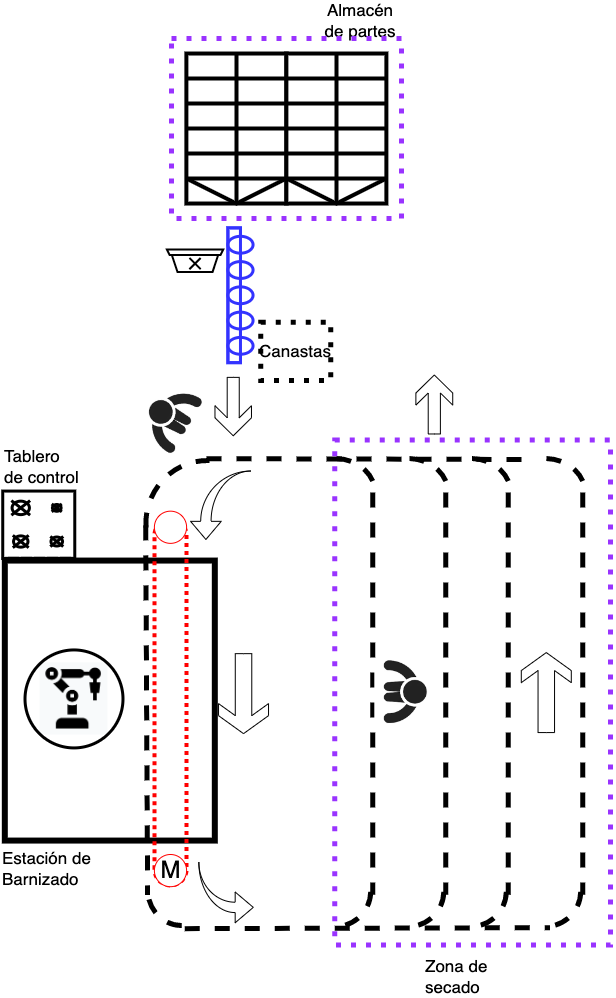
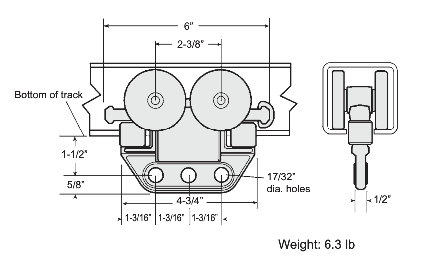
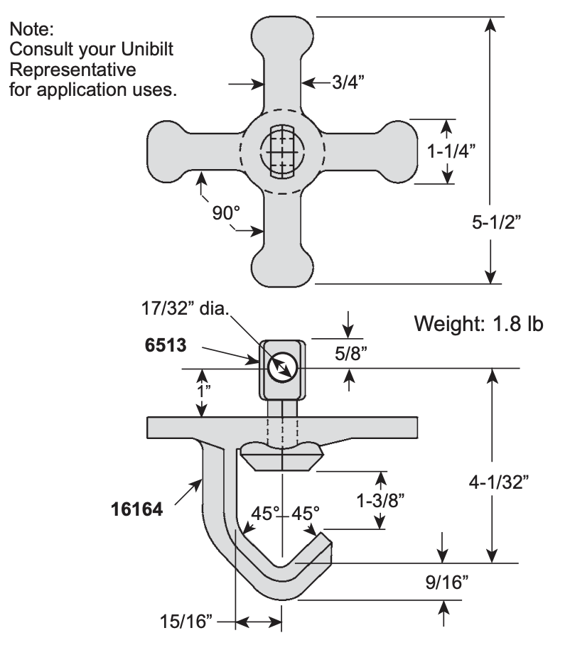
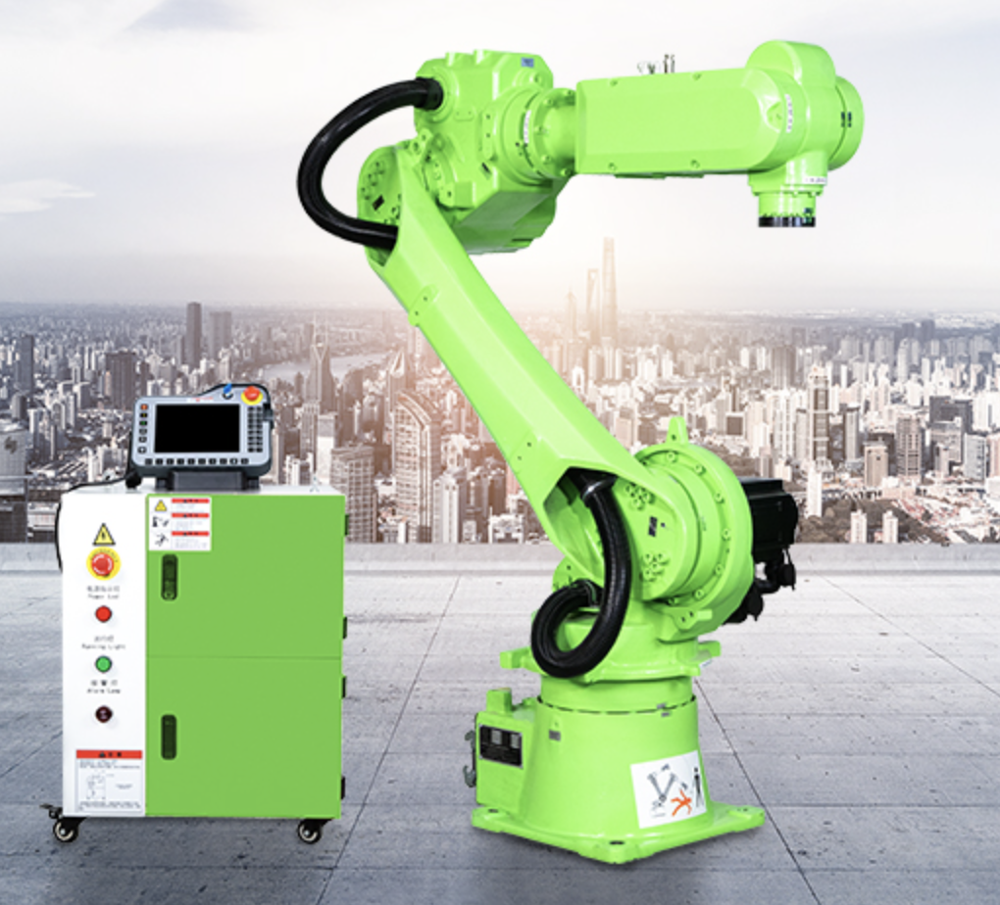
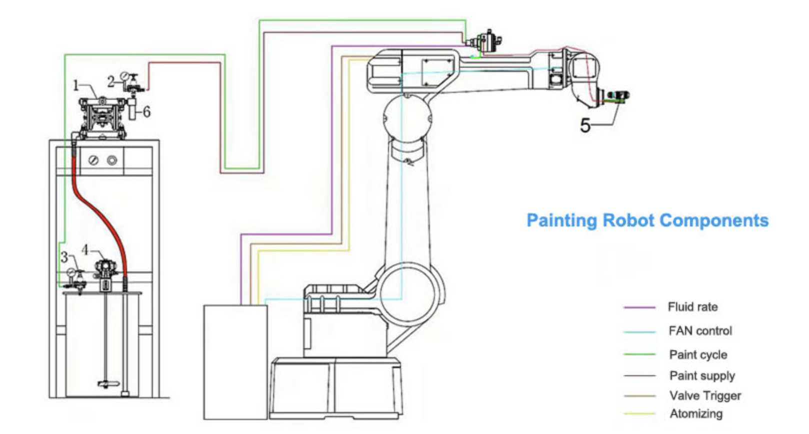

# Justificación de elección de procesos a automatizar con robotica.

## Consideraciones del proceso

Para hacer una correcta selección de los procesos a automatizar con robótica primero es pertinente recordar ciertos puntos sobre el proceso productivo en el que estamos trabjando.

Recordemos que se optó por una producción basada en lotes donde las materias primas pasan por una serie de procesos y estaciones hasta convertirse en las piezas finales; sin embargo los procesos y estaciones dependen de cada pieza y por ende estos procesos deben ser ajustables y parametrizados segun se requiera. Esto le permite al proceso ser flexible, adaptable y escalable, posibilitando la fabricación de nuevas piezas y productos sin mayores afectaciones a la linea de producción. Se optó por este metodo de manufacura por lotes dada la naturaleza del proyecto y de los productos diseñados.

Una vez mencionado esto, se exponen los procesos escogidos y la metodología a través de la cual se llevó a cabo el proceso de selección.

## Criterios de selección
Para la selección de procesos a robotizar se opta por realizar una matriz de selección, es decir se asignan diferentes criterios. Luego se da un puntaje a cada proceso y se ponderan estos puntajes para la selección final, a continuación se mencionan los criterios que consideraremos

- Repetitividad: Se refiere a qué tan monótona o repetitiva es la tarea a realizar.
- Nivel de capacitación requerido: La tarea requiere personal especifico para su realización.
- Flexibilidad: Que tantos cambios presenta la tarea, por ejemplo ajustes respecto a cambios de prodcutos o cambios en ritmos de producción variable.
- Volumen: Que volumen de piezas son procesadas.
- Factibilidad: Que tanto costo implicaria la automatización con robótica
- Impacto: Que nivel de impacto implica el proceso automatizado versus el tradicional.

## Procesos considerados
A continuación listamos algunos de los procesos considerados:
- Dimensionamiento y corte
- Fresado y perfilado.
- Lijado.
- Pintura y acabado.
- Inspección de calidad.
- Traslado de piezas entre bandas.

## Matriz de selección
Se lista cada proceso y el puntaje asignado en cada uno de los criterios, para la ponderación se asigna a cada criterio una cantidad diferente de puntos para una suma de 100, los criterios más importantes son el impacto respectoa  la no automatización del proceso, la repetitibilida y la factibilidad de la automatización con robots.

| Proceso                  | Repetitibilidad(20) | Necesidad P.C.(5) | Flexibilidad(10) | Volumen(15) | Factibilidad (25) | Impacto(25) | Total(100) |
|--------------------------|---------------------|-------------------|------------------|-------------|-------------------|-------------|------------|
| Dimensionamiento y corte | 10                  | 5                 | 8                | 8           | 5                 | 10          | 46         |
| Fresado y perfilado.     | 12                  | 5                 | 7                | 5           | 5                 | 10          | 44         |
| Lijado                   | 8                   | 5                 | 5                | 12          | 5                 | 15          | 50         |
| Pintura y acabado        | 8                   | 4                 | 9                | 12          | 15                | 15          | 63         |
| Inspección de calidad    | 17                  | 5                 | 8                | 13          | 22                | 20          | 85         |
| Traslado de piezas       | 18                  | 1                 | 8                | 13          | 25                | 20          | 85         |

- Respecto a la repetitibilidad se le asignan puntajes mas altos a los procesos de inspección de calidad y translado de piezas dado que estos procesos no se ven modificados en mayor medida por el cambio de pieza o producto.
- Respecto a la necesidad de personal capacitado todos los procesos relacionados con el maquinado de las piezas  y la inspección de calidad requieren personal dado que pueden generar afectaciones a la integridad del trabajador o de la pieza. Por otro lado  se considera que el traslado de las piezas no requiere personal altamente capacitado.
- Repecto a la flexibilidad de los procesos a todos se les asigna un puntaje similar dado que al tratarse de una producción basada en lotes todos requieren ajustes de parametros segun la pieza o producto. La diferencia de puntaje se asigna segun la magnitud de los cambios requeridos.
- Respecto al volumen se asigna mayor puntaje a los procesos que actuan como cuelllos de botella: Por ejemplo mientras que la entrada a corte es un tablero de madera y sale un lote completo de piezas, el lijado y la inspección de calidad se hace pieza a pieza o producto a producto.
- Respecto a la factibilidad se asigna mayor puntaje a los procesos de inspección de calidad y traslado de peizas dado que son procesos de pick and place por lo que no requieren equipos altamente especializados ni que requieran mayores intervenciones sobre el espacio, a diferencia de los robots necesarios para los otros procesos.
- El impacto respecto al traslado de piezas y la inspección de calidad se hace en comparación a un operario, por lo que se tienen puntajes mas altos, por otro lado el fresado y corte si bien requieren un operario para el setup, el corte y fresado es realizado por maquinas cnc.

## Comentarios respecto a los procesos
Teniendo esto en cuenta los dos procesos seleccionados son el tralado de productos entre bandas y la inspección de calidad, a continuación exponemos algunas cosideraciones adicionales respecto a esos dos procesos.
### Inspección de Calidad 
Nuestros productos a diferencia otros no tiene grandes requrimientos mecanicos, sin embargo la parte estetica es muy importante dado que es la que mas se relaciona con la calidad en productos de este nicho. Sin embargo la estetica no es algo que se pueda medir facilmente y a su vez estas medidas no serian objetivas si no que dependerian de la persona en cuestion. Una posible opción es tener un personal capacitado para esta tarea, sin mebargo consideramos que otra solución mas adecuada, economica y escalable es la implementación de un proceso robotizado basado en visión artificial. De esta manera podemos asegurar una metrica objetiva que ademas puede ser reprogramada segun requiera el usuario (cambios de color, textura, pieza, etc)

Por otro lado se tiene un proceso con bastantes factores variables, diferentes piezas, diferentes productos, posibilidad de diferentes colores. Esta información y variabilidad puede ser perfectamente procesada por un sistema robótico sin afectación alguna al proceso de producción. Esto sumado a que con estas implementaciones se eliminara el error humano en esta etapa contribuyendo a una mejor calidad global.

A si mismo es importante considerar el ritmo de producción que se tiene, pudiendo ser este variable consideramos que un sistema robotico podria responder de mejor manera estos cambios en volumen y velocidad de producción.
### Traslado de productos
Esta es una tarea sencilla pero altamente repetitiva y monotona, a su vez como en el caso de la isnpección de calidad esta sujeta a cambios en la velocidad y volumen de producción. Por ende se considera adecuada para automatización con robots, dado que la complejidad de su implementación seria baja y el operario podria ser mejor empleado en otras partes del proceso donde la automatización no sea viable y el trabajo manual sea estrictamente necesario.

# Cambios posteriores a la 1er sustentación
## Proceso a robotizar
En la matriz de selección realizada para la primer entrega no se tuvo en cuenta la automatización de esos procesos con alternativas distintas al uso de robots. Después de analizar posibles alternativas de automatización, se llegó a la conclusión de que la inspección de calidad se puede realizar con un simple pistón que retire los objetos de la banda transportadora. Así mismo, el traslado de productos es más fácil hacerlo mediante bandas/cadenas transportadoras. Por lo tanto se procede a analizar el proceso con el 3er mejor puntaje según la matriz de selección: *pintura y acabado*.
## Justificación del proceso de robotización
La introducción de un robot en la celda de manufactura para el barnizado de muebles de madera puede aportar una serie de beneficios significativos, tanto desde una perspectiva técnica como económica:

### Aumento de la productividad
Un robot puede operar de manera continua y constante durante las 8 horas de la jornada laboral, sin requerir descansos o pausas, lo que resulta en un aumento significativo de la productividad en comparación con un trabajador humano. Además, los robots pueden realizar movimientos simples y repetitivos de manera más rápida y eficiente que un trabajador humano, lo que reduce el tiempo total necesario para el proceso de barnizado y permite una mayor capacidad de producción; esto resulta en mejoras de hasta el 15% en la productividad del proceso.

### Mejora de la calidad del barnizado
Los movimientos precisos y uniformes de un manipulador antropomórfico permiten una mejor aplicación del barniz, lo que garantiza un acabado de alta calidad en cada mueble. Igualmente, la repetibilidad de los movimientos del robot los cuales aseguran una aplicación constante del barniz, evitando errores humanos como la falta de cobertura o la formación de marcas irregulares. Esto se traduce en una mejora de la calidad del producto final, lo que puede aumentar la satisfacción del cliente y la reputación de la empresa.

### Reducción de costos
Aunque la adquisición e implementación inicial de un robot puede tener un costo significativo, a largo plazo, la robotización puede resultar en ahorros de costos sustanciales. Al reemplazar a un trabajador humano, se eliminan los costos asociados con salarios, beneficios, capacitación y otras compensaciones laborales. Además, la eficiencia mejorada y la mayor productividad del robot pueden reducir los costos relacionados con el tiempo de producción y los materiales utilizados.

### Mejora de la seguridad laboral
Un trabajador dedicádo únicamente al barnizado de muebles con pistola de pintura está expuesto a los siguientes riesgos para su salud:
- **Inhalación de vapores y partículas**: Durante el proceso de barnizado, se liberan vapores y partículas de pintura al aire. La exposición continua a estos químicos puede causar irritación en los ojos, nariz y garganta, así como problemas respiratorios a largo plazo. Algunos tipos de pintura contienen sustancias tóxicas, como disolventes orgánicos, que pueden tener efectos dañinos para la salud si se inhalan en cantidades significativas.
- **Exposición dérmica**: El contacto directo con la pintura puede provocar irritación en la piel y posibles reacciones alérgicas. Algunas pinturas también contienen productos químicos que pueden ser absorbidos a través de la piel y causar efectos adversos en la salud.
- **Riesgo de lesiones oculares**: Las partículas de pintura suspendidas en el aire pueden ingresar a los ojos del trabajador, lo que puede provocar irritación, infecciones o lesiones más graves. Además, el uso inadecuado de gafas de protección o carencia de las mismas aumenta el riesgo de daños oculares.
- **Riesgo de incendio o explosión**: Algunas pinturas son inflamables y pueden representar un riesgo de incendio o explosión si entran en contacto con fuentes de ignición, como chispas eléctricas o llama abierta.
- **Condiciones ergonómicas deficientes**: La utilización prolongada de la pistola de pintura puede generar fatiga muscular y estrés físico debido al peso y la vibración de la herramienta. Las posturas incómodas y repetitivas pueden ocasionar lesiones musculoesqueléticas, como dolores de espalda, cuello y brazos.
La robotización de tareas peligrosas, puede reducir los riesgos para la salud y la seguridad de los trabajadores dado que los robots están diseñados para cumplir con rigurosas normas de seguridad y pueden operar en entornos potencialmente peligrosos sin correr el riesgo de lesiones o enfermedades laborales. Esto no solo protege a los trabajadores, sino que también puede disminuir los costos asociados con accidentes laborales y reclamaciones de indemnización.

# Diseño de celda robotizada
## Celda tradicional
Partimos del diseño de una celda de barnizado a mano, la cual consiste en un almacén de piezas por pintar, una mesa con estación de pintura (compresor y pistola, latas de barniz y solventes) y un almacén de secado. El flujo de proceso es en forma de U e inicia en el almacén de productos proveninetes de la zona de ensamble. El operario coge los productos del almacén y los lleva a la mesa de pintura, donde prepara la mezcla de barniz y aplica 1 capa de barniz. Posteriormente lleva el producto fresco al almacén de secado donde dependiendo el tipo de barniz a usar puede durar entre 1 y 2 horas hasta la próxima capa de pintura. El proceso de aplicación y secado se repite hasta completar 3 capas y el producto se almacena durante 24-48 horas hasta que cure por completo. Finalmente los productos terminados son transportados a la sección de empaquetado. 

## Celda robotizada
### Flujo de proceso
Se consideran 2 opciones: flujo lineal y flujo en U. Se escoge la opción del flujo en U principalmente porque reduce el espacio ocupado por la celda en la fábrica y permite que el mismo operario encargado de colgar los productos y supervisar el funcionamiento del robot se encargue también de manejar el almacenamiento y flujo de salida de productos curados hacia la zona de revisión de calidad.

Se propone el siguiente flujo de proceso: un operario saca del almacén de partes un lote listo para barnizar y lo ubica en la banda transportadora que se dirige a la celda robótica. Una vez ubicado en la celda, el operario cuelga los productos en la sección manual del transportador suspendido y los va dirigiendo a la sección automática. Una vez allá, el transportador lleva los productos hacia el robot, donde este gracias a sensores de linea detecta las piezas y escoge la rutina correspondiente para realizar el proceso de barnizado. Posteriormente las partes salen de la cabina de barnizado hacia la parte manual del transportador y allá un operario conduce las piezas hasta la zona de secado y almacenamiento, compuesta por varias lineas paralelas de transportadores, unidos por interruptores manuales que permiten mover los lotes de piezas a distintas lineas de almacenamiento. Finalmente luego de 24 horas de curado el operario conduce las partes hacia la zona de inspección de calidad.

### Mecanismo de transporte
Para el movimiento de las piezas se plantea el uso de transportadores suspendidos (overhead conveyor) de la marca Pacline. Se escoge la linea de productos Unibilt, transportadores de guías cuadradas cerradas diseñadas principalmente para lineas de pintura, ensamblaje y almacenamiento de partes. La guía cerrada ayuda a evitar la contaminación del interior de las guías y los carritos de transporte. 

A pesar de que los productos Unibilt ofrecen la posibilidad de emplear cadenas móviles para la fácil automatización del transportador, se opta por la versión manual, pues se ajusta más al flujo de partes deseado y se automatiza la parte correspondiente a la cabina de barnizado con una cadena de transmisión de potencia unida a un motor. Para el transporte de objetos se escogen los carritos manuales de 4 ruedas, con una capacidad de carga de hasta 250 lb.

A dichos carritos se les conecta un gancho giratorio de 90ª, que gracias a dos varillas ubicadas en la guía permite el giro de 180ª en las piezas para poder barnizarlas por ambos lados. A demás, la sujección por gancho facilita un acabado uniforme durante el barnizado.

### Robot
Se selecciona el robot SZGH-P1500-B-6, un brazo robótico antropomórfico de 6 ejes de la marca Shenzhen Guanhong Automation, diseñado especialmente para procesos de pintura industriales y que tiene las siguientes características:

| Característica           | Detalles            | 
|--------------------------|---------------------|
| Dimensión (L-W-H)        | 1000mm-1000mm-1000mm| 
| Payload                  | 6kg                 | 
| Peso                     | 125kg               | 
| Sustrato                 | Acero               | 
| Potencia                 | 1000W               | 
| Alcance                  | 1500mm              | 

Además, es necesario acoplar el sistema de suministro y aplicación de pintura, para lo cual se sigue el siguiente esquema:

El cual consiste de 4 partes fundamentales: la pistola de pintura, la bomba, el mezclador y el sistema de actuación electroneumática. También es importante resaltar que para evitar tiempos de secado excesivamente largos y la aplicación de varias capas de barniz se seleccionó el barniz de secado rápido y acabado mate Sayerlack Nitro, el cual solo requiere de la aplicación de 1 capa para un buen acabado y 24 horas de curado.

###

